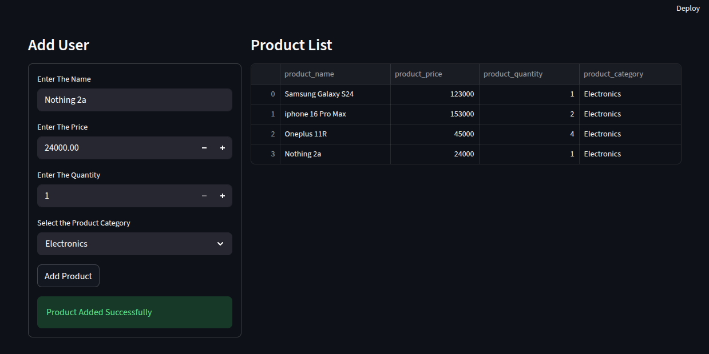

# Python Data Apps Labs

## 📌 Overview

A collection of data-driven applications built using Python, Streamlit, and Snowflake, focused on developing interactive dashboards and real-world data workflows.

---

## ⚡ Key Highlights

- Core Python programming and data handling  
- Interactive web apps using Streamlit  
- Data retrieval and visualization using Snowflake  
- Structured approach from fundamentals to applications  

---

## 📊 Applications Built

- Product Management Dashboard  
- User Data Viewer  
- File-based data processing tools  

---

## 📸 Screenshots

### 📊 Streamlit Application UI


---

## 🛠️ Tech Stack

- Python  
- Streamlit  
- Snowflake  
- SQL  

---

## 📂 Repository Structure

```bash
python-data-apps-labs/
├── python-fundamentals/
├── streamlit-apps/
├── snowflake-app/
├── screenshots/
├── README.md
```

---

## 🚀 How to Run

> Run Python files using `python filename.py` or launch Streamlit apps using `streamlit run app.py`.
